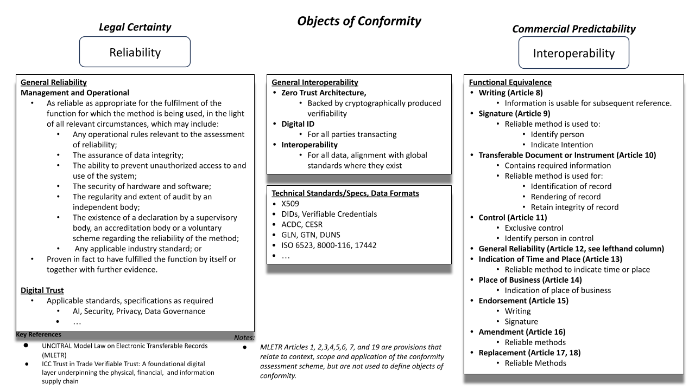

# Object of Conformity Overview

## Conformance with Model Law on Electronic Transferable Records

## Conformance Coverage

| Article Number | Description                                         |Conformance|
|----------------|-----------------------------------------------------|---|
| Article 1     | Scope of application|
| Article 2     | Definitions|
| Article 3     | Interpretation|
| Article 4     | Party Autonomy and Privity of Contract|
| Article 5     | Information Requirements|
| Article 6     | Additional information in electronic transferable records|
| Article 7     | Legal recognition of an electronic transferable record|
| Article 8     | Writing|[Applies](./writing.md)|
| Article 9     | Signature|X|
| Article 10    | Transferable documents or instruments|X|
| Article 11    | Control|X|
| Article 12    | General reliability standard|X|
| Article 13    | Indication of time and place in electronic transferable records|X|
| Article 14    | Place of business|X|
| Article 15    | Endorsement|X|
| Article 16    | Amendment|X|
| Article 17    | Replacement of an electronic transferable record with an electronic transferable record|X|
| Article 18    | Replacement of an electronic transferable record with a transferable document or instrument|X|
| Article 19    | Non-discrimination of foreign electronic transferable records|

