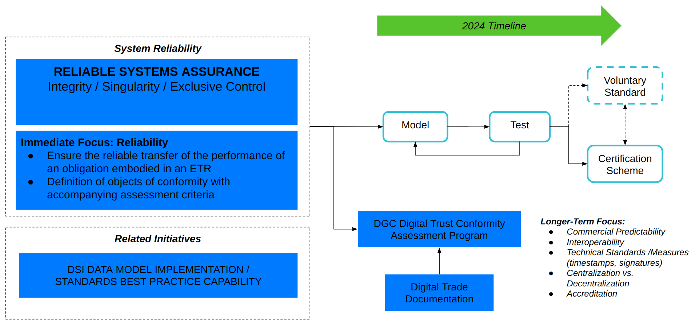

# Working Group Draft Scheme

## Context Overview

This is the working group draft conformity assessment scheme. The digram below depicts a minimum viable product (MVP) that can be developed and tested.

## Scope of Application

The initial scope of application is for intended for **trade documents**, but with the view that the scheme can be applied to the related categories of **negotiable documents** and **title documents**.

Comparing the related categories:

- **Trade Documents:**  Documents that can be used in the buying and selling of goods and provide information such as product information,quantity, quality, and other relevant details essential for the transaction.
- **Title Documents:** Documents that can be used to establish the ownership of the goods and are crucial in the transfer of ownership from the seller to the buyer.
- **Negotiable Documents:** Documents that can be transferred from one party to another, typically through endorsement or delivery, allowing the holder to claim the goods or receive the benefits outlined in the document.

### Objects of Conformity

The objects of c

1. [Reliable Systems Assurance](./obj-reliable-system.md)
2. [Integrity](./obj-integrity.md)
3. [Singularity](./obj-singularity.md)
4. [Exclusive Control](./obj-exclusive-control.md)

### General Requirements

General requirements that apply to the implementation and/or accreditaton of the conformity assessment scheme.

1. Accreditation of Independent Entities: Ensuring that entities responsible for verifying the technical procedures' suitability are properly accredited.
2. Monitoring and Surveillance: Implementing processes to continuously monitor compliance with these criteria and applicabe regulatory provisions.
3. Documentation and Records Keeping: Verifying that all required documents, changes, and transactions are properly documented and preserved.
4. Complaints and Feedback Mechanism: Establishing a system to handle complaints and feedback related to the electronic documents and the conformity assessment process.

